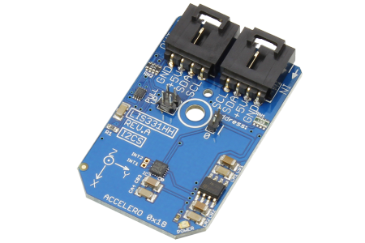

[](https://www.controleverything.com/content/Accelorometer?sku=LIS331HH_I2CS)
# LIS331HH
LIS331HH 3-Axis Accelerometer

The LIS331HH device, provides digital acceleration for X, Y and Z axis.

This Device is available from ControlEverything.com [SKU: LIS331HH_I2CS]

https://www.controleverything.com/content/Accelorometer?sku=LIS331HH_I2CS

This Sample code can be used with Raspberry pi, Arduino and Particle.

## Java
Download and install pi4j library on Raspberry pi. Steps to install pi4j are provided at:

http://pi4j.com/install.html

Download (or git pull) the code in pi.

Compile the java program.
```cpp
$> pi4j LIS331HH.java
```

Run the java program.
```cpp
$> pi4j LIS331HH
```

## Python
Download and install smbus library on Raspberry pi. Steps to install smbus are provided at:

https://pypi.python.org/pypi/smbus-cffi/0.5.1

Download (or git pull) the code in pi. Run the program.

```cpp
$> python LIS331HH.py
```

## Arduino
Download and install Arduino Software (IDE) on your machine. Steps to install Arduino are provided at:

https://www.arduino.cc/en/Main/Software

Download (or git pull) the code and double click the file to run the program.

Compile and upload the code on Arduino IDE and see the output on Serial Monitor.


## Particle Photon

Login to your Photon and setup your device according to steps provided at:

https://docs.particle.io/guide/getting-started/connect/photon/

Download (or git pull) the code. Go to online IDE and copy the code.

https://build.particle.io/build/

Verify and flash the code on your Photon. Code output is shown in logs at dashboard:

https://dashboard.particle.io/user/logs

#####The code output is raw value of acceleration in X, Y and Z Axis.
